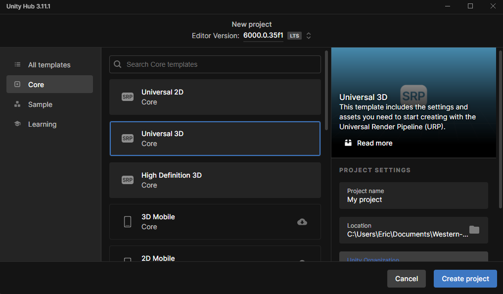

# Overview
This repository contains the code for the "Exploring Generative Agents in Unity" project. Since the project used several licensed assets, the full Unity project can't be uploaded. This README file explains how to set up the Unity project to replicate the project assuming that the same or similar assets are available.

The following assets were used in the project:
- [Polygon - Town Pack](https://syntystore.com/products/polygon-town-pack?_pos=1&_sid=12761b3f3&_ss=r): 3D models for the environment and agent.
- [Odin Inspector and Serializer](https://assetstore.unity.com/packages/tools/utilities/odin-inspector-and-serializer-89041): **Optional**. Used for adding properties for better organization in the Unity Inspector window. It's not necessary for the project, if not available just remove any code that gives errors.
- [LLM for Unity](https://assetstore.unity.com/packages/tools/ai-ml-integration/llm-for-unity-273604): LLM integration with Unity.
- [Advanced Input Field 2](https://assetstore.unity.com/packages/tools/gui/advanced-input-field-2-185464): Emoji support in Unity.
- [Serializable Dictionary](https://github.com/azixMcAze/Unity-SerializableDictionary): Having serialized dictionaries in Unity.

# Unity project configuration

The project was made using Unity 6.

## Project creation and settings

1. Create a Universal 3D Core project

2. Import all the assets. If using the Synty Polygon Town pack, make a copy of the demo scene

3. Follow the instructions for creating an [emoji font asset](https://discussions.unity.com/t/advanced-input-field/672548) and make sure to add the corresponding scripting define symbols in the Player section of Project Settings.

## World representation

1. Create an empty game object for the world representation and add the WorldTree script.

2. For each location of the world, create a game object with a box collider (set as trigger) that encompases the whole location and the AreaTrigger script

3. For each section within the location, create a game object with the box collider set as trigger and the AreaTrigger script set as section. Also add the ObjectState script to any object in the section.

4. Also create a game object that will represent the teleport location for the agent at each section.

## Simulation settings

Create a simulation settings game object, attach and configure the scripts as shown in the images.

For the memory configuration, the following settings were created:

- Sensory memory
  
- Short-Term memory
  
- Long-Term memory
  

## Agents

The agent was configured using one of the Polygon Town pack characters. Attach the scripts as shown in the images.

The knowledge profile and agent templates that were used for the project were configured as shown here:

